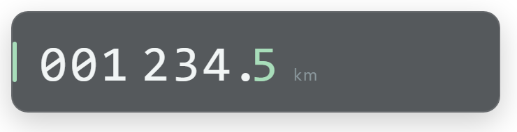
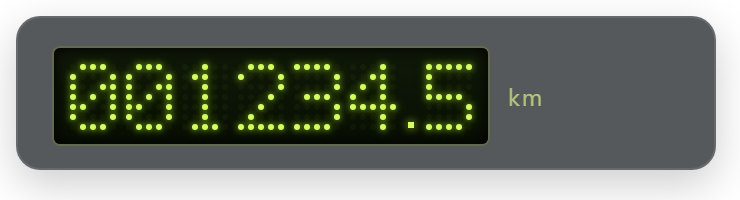
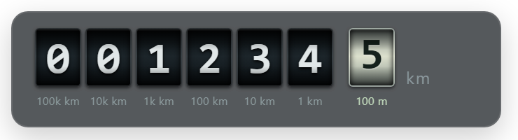

# Kapps Odometer — одометр для каждой машины



Накопительный пробег отдельно для каждой модели iRacing. Работает как Custom
Overlay в Kapps: для самого виджета не нужны Python, отдельная программа или
сборка исходников. Нужны уже работающие Kapps и iRacing на Windows.

[Скачать v0.2.0](https://github.com/AT-Vadim/kapps-odometer/releases/download/v0.2.0/Odometer-Kapps-v0.2.0.zip) · [English documentation](README.md)

## Установка

1. Скачайте **Odometer-Kapps-v0.2.0.zip** в разделе **Releases** этого репозитория.
   Нужен именно установочный архив, а не автоматически созданный GitHub Source code.
2. В Kapps откройте **Settings → Apps Folder**. Если другие custom-виджеты уже
   установлены, используйте существующую папку. Иначе создайте, например,
   `Документы\KappsApps`, выберите её в этом поле и нажмите **Save**.
3. Распакуйте архив **внутрь Apps Folder**, чтобы получилось:

   ```text
   KappsApps/                 ← в Kapps выбирается ЭТА папка
     Odometer/
       index.html
     README.md
     README.ru.md
     LICENSE
     CHANGELOG.md
   ```

   **Не выбирайте саму папку Odometer в Apps Folder.** Между выбранной папкой
   и Odometer не должно быть лишней папки с названием архива.
4. В **Racing Overlay → Add Custom Overlay** добавьте:

   ```text
   Name: Odometer
   URL:  http://127.0.0.1:8182/Odometer/
   ```

5. Выделите виджету примерно **370 × 100 px** и разместите его на экране.
6. Откройте Racing Overlay, сядьте в свою машину в живой сессии iRacing и поезжайте.

Apps Folder раздаёт HTML-файлы, а не запускает CMD/EXE. Добавленный одометр
загружается вместе с остальными виджетами Racing Overlay. **Оверлей должен
оставаться открытым для подсчёта.** Сам выбор Apps Folder не включает
автоматическое открытие Racing Overlay при запуске Kapps.

## Возможности

- Свой пробег для каждого CarID; трасса, сессия, окраска и номер машины не влияют.
- Отдельные Legacy-модели с другими CarID учитываются отдельно.
- Только цифры и km; прокрутка каждые 100 м, фон с непрозрачностью 70%.
- Движение задним ходом, по пит-лейну и за пределами трассы учитывается.
- Гараж, эвакуация, повторы, отсутствие свежих данных и выход из машины
  приостанавливают подсчёт.

Публичная версия начинает с нуля. В ней нет личного пробега автора, аккаунтов,
телеметрических логов, аналитики или удалённых библиотек. Расстояние приблизительное:
оно вычисляется по скорости и времени симуляции. Пробелы телеметрии не
достраиваются, поэтому при зависаниях возможен небольшой недосчёт. Прошлые
заезды iRacing автоматически не импортируются.

## Выбор оформления

На странице статистики в том же профиле Kapps откройте:
`http://127.0.0.1:8182/Odometer/?manage=1`.

В блоке «Оформление одометра» выберите один из трёх стилей. Выбор сохраняется
автоматически для всех машин и применяется к другим открытым виджетам примерно
за секунду. Предпросмотр использует вымышленные данные и не меняет пробег.

- **Минималистичный** — исходный вариант с прокруткой цифр.
- **Электронный · пиксели** — жёлто-зелёные цифры из точек 5 × 7. При изменении
  цифра кратко мигает. Раз в 5–10 минут подмигивает часть одной цифры; общий
  сохранённый таймер не допускает этого чаще раза в пять минут, даже после
  перезагрузки или при нескольких открытых окнах.
- **Механический · колёсики** — подписанные разряды. Светлое колёсико **100 m**
  непрерывно вращается между цифрами по дробной части пройденного расстояния.
  Километровые колёсики плавно переключаются при накоплении целого километра
  или переносе соответствующего разряда. При остановке пробега движение прекращается.




Во всех стилях непрозрачность внешнего фона — 70%. Системная настройка уменьшения
анимации отключает мигание и плавные переходы. Оформление сохраняется отдельно
от пробега и не входит в JSON-копию расстояний.

## Сохранение, резервная копия и перенос

Пробег сохраняется автоматически в **IndexedDB браузера Kapps**, а не рядом
с index.html. Обычные перезапуски и обновление HTML его не сбрасывают.
Очистка данных сайтов или удаление профиля Kapps может стереть пробег —
перед этим экспортируйте резервную копию.

Используйте один адрес `127.0.0.1:8182` и один профиль Kapps. Адрес localhost
перенаправляется на 127.0.0.1. Другой браузер, профиль, компьютер или порт имеют
своё хранилище. Несколько виджетов в одном хранилище не удваивают пробег;
разные профили независимы. Разделения по пользователям iRacing нет.

Для управления **временно замените URL этого Custom Overlay внутри Kapps** на:

```text
http://127.0.0.1:8182/Odometer/?manage=1
```

Увеличьте окно и включите взаимодействие с ним. **Download backup** скачивает
JSON, **Import JSON** восстанавливает его. Затем верните обычный URL.
Страница управления сама пробег не считает. Если открыть её в другом браузере,
будут показаны данные того браузера, а не Kapps.

Импорт объединяет модели, выбирая больший пробег каждой. Он не складывает
два значения и не уменьшает существующее. Поддерживается также odometer.json
от раннего Python-прототипа.

## Обновление и удаление

Сделайте резервную копию, закройте виджет, замените `Odometer/index.html` и
откройте прежний URL. Не очищайте данные сайтов. Для удаления уберите Custom
Overlay и папку Odometer. Данные браузера от этого автоматически не удаляются.

## Если что-то не работает

| Проблема | Решение |
| --- | --- |
| `FileNotFoundError: apps/Odometer/index.html` | Выберите родительскую папку, внутри которой находится Odometer, и нажмите Save. Проверьте дерево установки выше. |
| Страница не открывается | Запустите Kapps; его сервер должен работать на стандартном порту 8182. |
| Счётчик стоит на нуле | Сядьте за руль в живой сессии и проедьте 100 м. Гараж и повторы не учитываются. |
| В Chrome другой пробег | Chrome и Kapps имеют отдельные хранилища. Управляйте пробегом в том же профиле Kapps. |
| Пробег пропал после очистки данных | Импортируйте сохранённый JSON через страницу управления. |
| Подсчёт останавливается при закрытии/скрытии | Виджет должен оставаться загруженным; приостановленная страница не может надёжно считать расстояние. |

В самом оверлее специально нет статусов и сообщений об ошибках. Для диагностики
используйте консоль разработчика страницы. При ошибке хранилища виджет не
переключается незаметно на временное сохранение.

## Статус версии

**v0.2.0.** Протокол сверён с Kapps **1.24.38**, подключение к серверу проверено.
Проверены расчёт, смена машин, фильтры повторов/гаража/эвакуации, сохранение,
защита от двойного подсчёта, импорт и отображение. Полная проверка во время
езды в iRacing и во всех режимах отображения Kapps пока не завершена.
Об ошибках можно сообщать через Issues, приложив версию Kapps и шаги повторения.

## Для разработчиков

Для установки исходники собирать не нужно. Для изменений потребуются Node.js 18+
и Python 3.10+ (Python нужен только для упаковки ZIP):

```sh
node tests/accounting.cjs
node scripts/build.mjs
python scripts/package.py
```

Исходники — `src/`, готовый файл — `Odometer/index.html`, архив и SHA-256 — `dist/`.
Сборка всегда использует пустое начальное хранилище. Уже сохранённые данные
браузера сохраняются. Режим `?demo=1` показывает анимацию на вымышленных цифрах
без подключения к телеметрии и сохранения; пример запуска есть в английском README.

Лицензия [MIT](LICENSE). Независимый проект сообщества, не связанный с iRacing
или Kapps официально. Автор Kapps — [kutu](https://kapps.kutu.ru/).
Kapps и SDK iRacing не распространяются вместе с виджетом.
